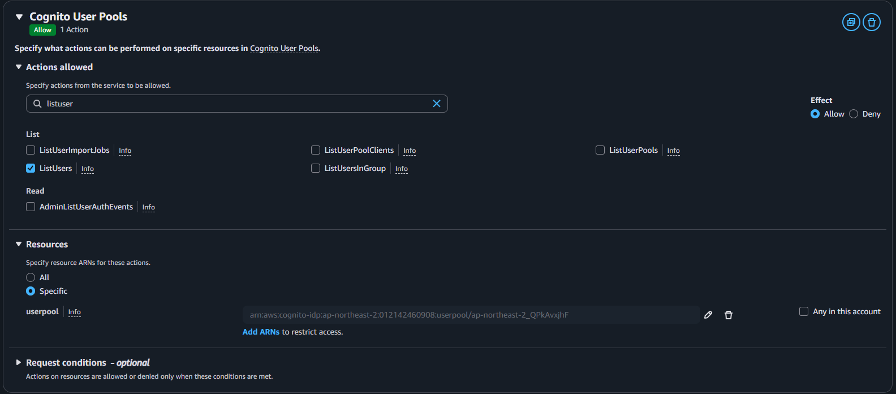

# Preventing Duplicate Emails

Lambda Triggers를 이용하여 이메일 중복을 방지할 수 있다

---

## cognito → user pools → extensions → Lambda triggers

1. Lambda → create new function(CognitoPreSignUp_UniqueEmail)
    
    ```cpp
    import { CognitoIdentityProviderClient, ListUsersCommand } from "@aws-sdk/client-cognito-identity-provider";
    
    export const handler = async (event) => {
      const email = event.request.userAttributes.email;
    
      const cognitoIdentityProviderClient = new CognitoIdentityProviderClient( { region: process.env.REGION } );
      const listUsersInput = {
        UserPoolId: event.userPoolId,
        Filter: `email = "${email}"`
      };
      const listUsersCommand = new ListUsersCommand(listUsersInput);
    
      try {
        const listUsersRespone = await cognitoIdentityProviderClient.send(listUsersCommand);
        if (listUsersRespone.Users.length > 0) {
          throw new Error("Email already exists");
        }
        return event;
      } catch (error) {
        console.log(error);
        throw new Error(error.message);
      }
    };
    ```
    
2. Create Roles → set Actions(Cognito user pools) → set actions allowed(listusers) → add arns(get arn from user pool)
    
    
    
3. Add permission in that role(attach policies)
    
    
    
4. You can test this by Invoking the cognito sign up function